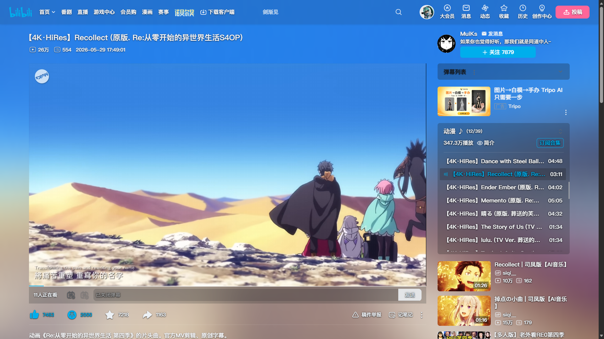
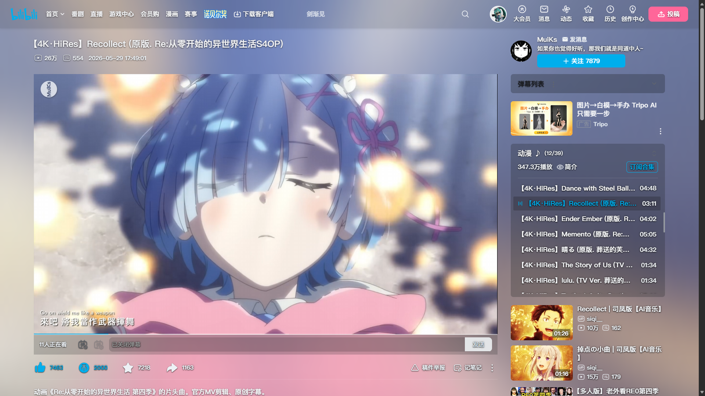
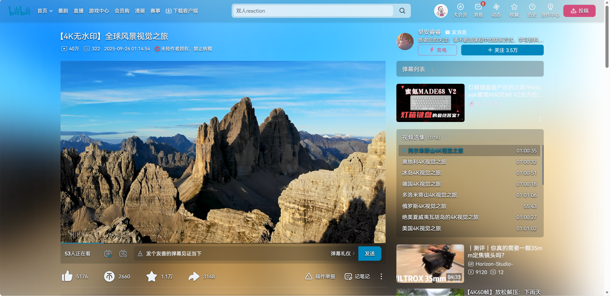
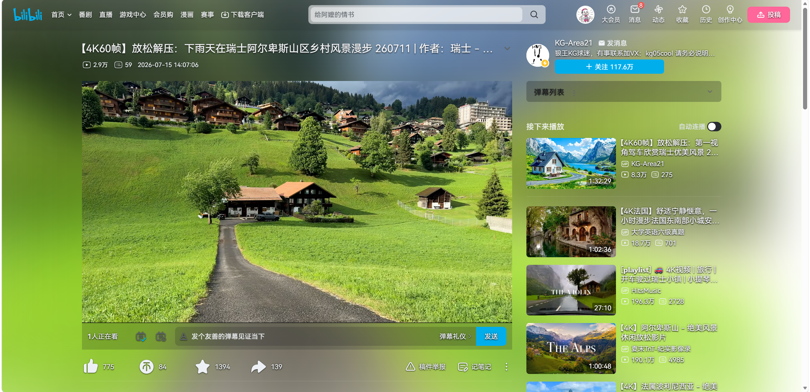

# Bilibili Ambilight

为 Bilibili 播放页添加随视频画面变化的柔和环境光。适用于 Chrome 和 Microsoft Edge，当前版本 **1.0.4**，无需构建即可加载。

**特别致谢：[WesselKroos/youtube-ambilight](https://github.com/WesselKroos/youtube-ambilight)。** 本项目参考其环境光实现思路，并针对 Bilibili 的播放器和页面布局适配。参考项目采用 MIT 许可证，版权及许可声明见 [第三方说明](THIRD_PARTY_NOTICES.md)。

## 效果展示

| 示列1 | 示列2 |
| --- | --- |
|  |  |

| 示列3 | 示列4 |
| --- | --- |
|  |  |

截图中的视频、页面内容及标识属于相关权利人，仅用于展示扩展效果。

## 功能

- 根据视频画面生成环境光，提供模糊、扩散和颜色渐变。
- 支持 BewlyCat 原生播放页的明暗主题、顶栏与菜单配色，以及抽屉内播放。
- 改善投票选项的文字可读性。

BewlyCat 自定义宽屏布局暂未适配。

## 支持页面

| 类型 | 路径 |
| --- | --- |
| 普通视频 | `/video/…` |
| 番剧、影视播放 | `/bangumi/play/ep…`、`/bangumi/play/ss…` |
| 稍后再看 | `/list/watchlater` |
| 收藏夹、合集及播放列表 | `/list/…` |
| 旧版播放入口 | `/medialist/play/…`、`/watchlater/…` |

不适配直播、课堂课程、外链嵌入播放器和活动专题播放页。旧版入口仅在页面包含可识别播放器时生效。

## 安装与更新

1. 下载本仓库源码 ZIP 并解压，或从 [Releases](https://github.com/Akalin10/Bilibili-Ambilight/releases/latest) 下载已发布的安装包并解压。源码版本与 Releases 安装包版本可能不同。
2. 打开 `chrome://extensions` 或 `edge://extensions`，启用“开发者模式”。
3. 选择“加载已解压的扩展程序”，选中含 `manifest.json` 的项目目录，再刷新播放页。

更新文件后，在扩展管理页点击重新加载并刷新播放页。关闭环境光或离开支持的播放页后，扩展会撤销自己的页面样式。

## 设置

点击扩展图标打开设置，修改后自动保存。

| 设置 | 用途 |
| --- | --- |
| 模糊、扩散 | 调整光的柔和程度及覆盖范围 |
| 渐变时长 | 调整画面颜色切换的平滑程度；设为零关闭渐变 |
| 强度 | 调整环境光透明度 |
| 饱和度、亮度 | 调整整个环境光的颜色，不改变视频本身 |
| 渲染质量 | 自动或固定采样分辨率 |
| 帧率上限 | 限制环境光更新频率，最高 60 FPS |
| 恢复默认 | 重置所有设置 |

## 隐私与权限

视频采样和渲染均在本地进行，设置仅存于浏览器本地。扩展没有遥测、外部数据上传或网络请求功能。使用 `storage` 权限及 Bilibili 站点内容脚本，详见 [隐私说明](PRIVACY.md)。

## 开发

运行代码位于 `src/`，播放页及菜单样式位于 `styles/`，图标位于 `assets/`。项目不依赖打包工具或第三方运行库；修改文件后重新加载扩展即可验证。

性能取决于设备、浏览器与视频解码方式。遇到卡顿可降低渲染质量或帧率上限。

## 许可与参考

软件代码采用 [MIT License](LICENSE)。参考项目为 **[youtube-ambilight](https://github.com/WesselKroos/youtube-ambilight)**，作者 **Wessel Kroos**，核对版本 **2.38.17**。原始 MIT 声明完整保留在 [licenses/youtube-ambilight-MIT.txt](licenses/youtube-ambilight-MIT.txt)。
